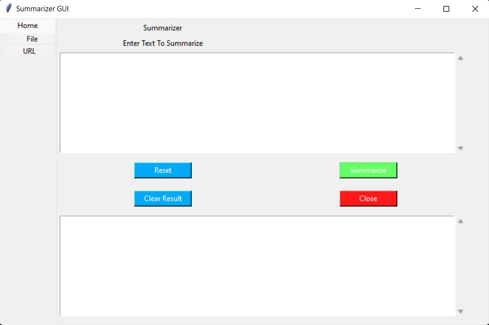
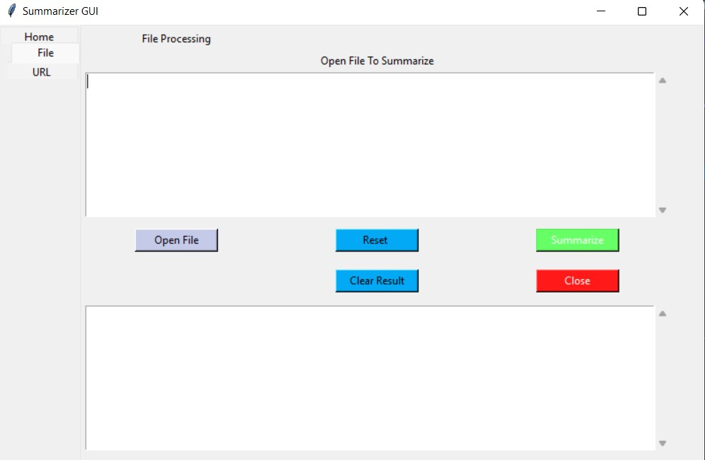
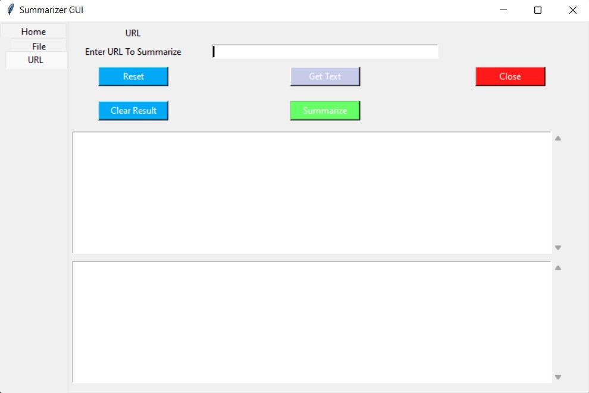

# Doc-Summarization
Document Summarization done using spacy 

* In home section, we copy and paste the text we would like to summarize.  

 
 
 

* In this section, upload a .txt file, after uploading click the get text button to read the text from the file. Lastly, click summarize button to summarize.  

 
 
 

* We can also summarize text using a url. Copy and paste the url in the url text box and click get text button to read all the text from the given url, click summarize get the summaization.  

